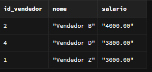

# queries-versotech

Olá Pessoal! Seguindo as intruções do desafio:

"Instruções

-Desafios: Resolva cada um dos desafios propostos escrevendo as queries SQL apropriadas.

-Retorno Esperado: Certifique-se de que as consultas retornem os resultados esperados, incluindo os nomes das colunas especificados.

-Validação: Após finalizar todas as consultas, valide suas respostas no compilador online de PostgreSQL: SQL Fiddle.

-Entrega: Submeta suas consultas finais em um repositório próprio seu!"

# Passo a Passo

01- Foi criado um banco de dados pelo SUPABASE, e por lá pude observar o esquema das tabelas e suas colunas. Assim ficou mais claro para realizar as consultas do desafio.

02- Após realizar as consultas no banco de dados e buscar corretamente os resultados, realizei novamente a validação pelo SQL Fiddle conforme solicitado.

03-Em consultas.sql estão todas as queries comentadas, também separei um arquivo.sql para cada query.

# Resultados:

-- Query 01 

-- Query 02

-- Query 03

-- Query 04

-- Query 05 
